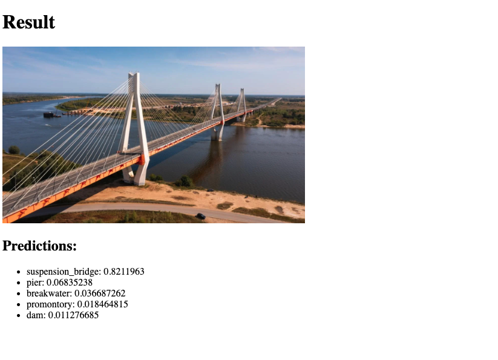

# Predection Model.

* This repo a simple implementation of pre compled model vgg16 which is convolutional neural network that has 16 layers deep.
* A simple web app, expects any image with jpg, jpeg, png format, and it responds back with a predection of objects in the image.

## Pre-requsites:
* Python - 3.11
* Docker

## Run it local
* Install all the dependencies
  ``` pip install -r requirements.txt```

* Run 
  ```python3 app.py```

* All the images uploaded are stored in a directory **uploads**
* The application is available on http://localhost:5000 or http://127.0.0.1:5000
* 
* Upload a choice of image and hit submit.
* 